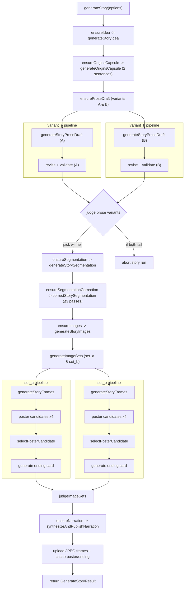
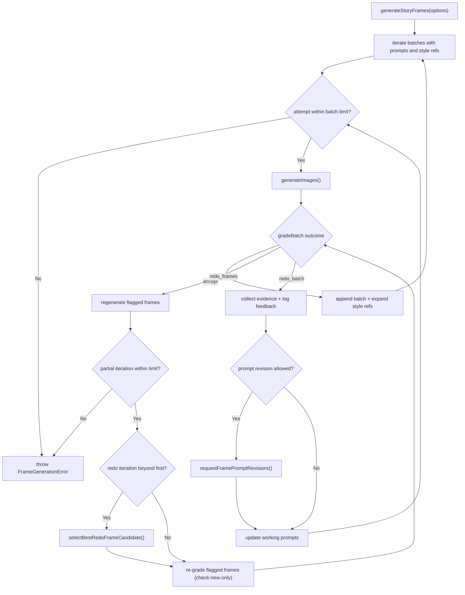
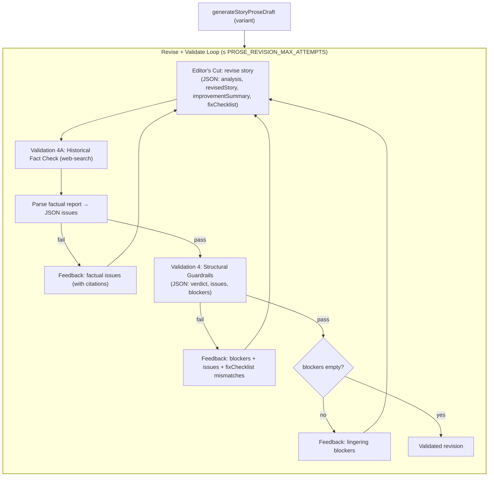

# Story Generation Narrative

This document captures the conceptual flow that powers the historical story pipeline. It is language-agnostic and focuses on the orchestration steps, model prompts, and quality gates rather than runtime commands.

## End-to-End Orchestration



### Prose Ideation

Story drafting runs through research, a locked micro-stage, dual variants, and judging. Each major stage writes a checkpoint (`idea.json`, `origins_capsule.json`, `prose.json`, `prose-revision.json`):

1. **Story Architect's Brief** — web-search-enabled research that identifies the canonical anchor, stakes, conceptual essence, contrasting foil, analogy candidates, modern pivot, and glossary. Output is a structured brief.
2. **Origins Capsule (locked facts)** — a 2-sentence capsule (≤40 words total) using neutral naming (e.g., “now known as …”) with hedged nuance. A dedicated fact-checker validates the capsule; on failure it retries with additional hedging guidance.
3. **Narrative Weaver (two variants)** — produces two 250–450 word drafts (title + paragraphs) that must place the Origins Capsule in the first half, limit to one named figure, and keep the modern tie-in for the ending using approved hedged templates.
4. **Narrative Editor's Cut (per variant)** — scores and revises each draft, returning JSON (`analysis`, `revisedStory`, `improvementSummary`, `fixChecklist`).
5. **Fact-Check Gate** — runs in two passes: a web-search factual pass (text report parsed into JSON) and a structural guardrails pass that must return a normalized `blockers` object. Failures loop back into another revision attempt per variant (up to `PROSE_REVISION_MAX_ATTEMPTS`).
6. **Prose Variant Judge** — compares the two validated revisions with their analyses and picks the winner. Only the winning text proceeds.

### Segmentation Blueprint

Segmentation restructures the prose into narration slices and illustration prompts. It solicits alternating voices, poster/ending cards, and strict scene composition rules:

```text
Requirements:
1. Provide `title`, `posterPrompt`, ten chronological `segments`, and `endingPrompt`.
…
2. `posterPrompt` … Visible text must include a bold 2-4 word title, the protagonist’s name, and a single 4-digit year. Keep every supporting element under six words and period appropriate.
…
4. For each of the ten `segments`:
   • Provide `narration` … Alternate between the `M` and `F` voices whenever the flow allows.
   • Provide `imagePrompt` … Focus on subject, action, setting, and lighting cues.
5. Keep each `imagePrompt` drawable as a cinematic single-scene illustration with modern storyboard energy; avoid multi-panel layouts, mirrored halves, or overly technical camera jargon.
6. Avoid collapse-prone specifics: no exact dates, numeric lists, or written equations in the panels. Exception: the poster may include a single 4-digit year alongside the title and protagonist’s name. Keep visible text minimal (headlines ≤4 words; signage/mottos ≤6 words) and on physical surfaces only.
…
9. Ensure the protagonist appears whenever the narration centres on them; environmental cutaways are fine when explicitly described.
…
13. Keep the ten story segments purely historical—save any modern tie-in for the `endingPrompt`, and keep it brief.
```

The narration sentences generated here are now preserved verbatim through the image pipeline. Each frame’s narration bundle is attached to later grading and prompt-revision calls so the models can re-ground revisions without drifting from the original story beat.

### Prompt Correction Loop

The segmentation is checked up to three times by a correction prompt that only rewrites offending images. It lists every panel with narration context and reminds the grader about catastrophic issues (missing protagonist, floating abstractions, etc.). If corrections are returned they are applied immediately; otherwise the segmentation is accepted.

## Frame Generation Workflow

Poster, story panels, and ending card are produced twice (Set A and Set B). Each set shares the `ART_STYLE` prompt bundle: feature-quality 16:9 illustrated frames with modern graphic-novel energy, expressive lighting, cohesive palettes, grounded period details, and strict bans on photorealism, collage artefacts, heavy borders, or multi-panel layouts.

### Batch Grading Loop

`generateStoryFrames` drives the panel production with a batch-oriented retry loop:



Key concepts:

- **Style propagation:** Each batch carries forward a sliding window of prior frames (`overlapSize`) so characters remain consistent; accepted images join the reference pool for partial redos.
- **Catastrophic grading:** The grader schema enforces explicit outcomes (`accept`, `redo_frames`, `redo_batch`) and collects frame indices plus reasons to keep failures explainable.
- **Targeted redos:** When only specific frames fail, they are regenerated individually—each with up to four image attempts—before being re-graded in isolation. Batch retries are capped by `BATCH_GENERATE_MAX_ATTEMPTS`.
- **Fallback comparison:** From the second partial redo onward, the text judge compares the newest candidate to the prior keeper before deciding which image survives.
- **Narration awareness:** The narration lines for each frame (voice + text) travel with the prompts and are surfaced to graders and prompt revisers so replacements stay faithful to the authored script.
- **Deterministic failure:** Exhausting batch retries or frame redo attempts throws immediately, surfacing fatal quality issues to the caller.

### Prompt Revision Assist

Whenever the grader escalates to `redo_batch`, the pipeline (at most once per batch) consults a text model to rewrite the problematic prompts instead of blindly retrying the same wording. The request bundles:

- the global style prompt and catastrophic checklist,
- the accumulated feedback log across all failed attempts,
- narration excerpts per frame,
- semantic captions/scores plus thumbnails when available, and
- the previous illustration prompts.

The model must return JSON `replacements` where each entry includes a 1-based frame index, a rationale, and the revised prompt. Accepted revisions overwrite both the working prompt list and the batch-local prompts before the next retry. If the revision service fails or returns no applicable changes, the batch continues with the existing prompts, but the attempt is still counted towards the retry limit.

### Poster Selection and Ending

After the ten interior frames are locked:

- **Poster candidates:** Each image set spins four concurrent poster renders against the same style prompt and leading frame references. A text-grade pass evaluates all candidates, flags catastrophic artefacts, and selects the most stunning acceptable poster.
- **Poster typography:** The selector enforces the bold 2–4 word title, the protagonist’s name, and a single 4-digit year; any supporting text must stay under six words and remain period-appropriate.
- **Ending card:** The last few interior frames seed the style references for a single ending-card render, generated through the same single-image helper that trims prompts and handles retries.

## Dual-Set Comparison

Each run produces two full sets (`set_a`, `set_b`). A Gemini text judge receives every image inline alongside its prompt and returns:

```json
{
  "reasoning": "…",
  "verdict": "set_a"
}
```

Only the winning set is kept for downstream storage. The judge weighs prompt fidelity, cinematic single-scene composition, typography limits, and whether the protagonist appears whenever the narration centres on them (environmental cutaways are fine when prompted).

## Media Packaging

- **Filtering:** Frames 1-10 (indices 1..10) feed the session’s media timeline; poster and ending are excluded from narration assembly but re-encoded and uploaded as supplementary stills so the client can display them without Ken Burns motion.
- **JPEG normalisation:** Images are re-encoded (quality 92, 4:4:4) prior to upload.
- **Narration synthesis (post-judging):** The alternating `M` / `F` segments from the winning set are passed to the narration pipeline, keeping the same order as the frames.

The result bundle contains the story text, accepted segmentation, storage paths for the ten canonical frames, poster/ending still references, and narration metadata. No runtime command knowledge is required to reason about these steps; the process hinges on prompt engineering, iterative grading, and consistent style handoff between model calls.

## Revise + Validate Flow



Notes
- Validation runs in two passes: 4A (factual with web-search → parsed) then 4 (structural guardrails).
- The guardrails validator must return a normalized `blockers` object with keys `namingAttribution`, `exclusivityClaim`, `modernTieInOverclaim`, `datePrecision`, `wrongEntity`.
- The editor’s `fixChecklist` mirrors those keys; mismatches generate explicit feedback and another revision attempt, up to the configured limit.
