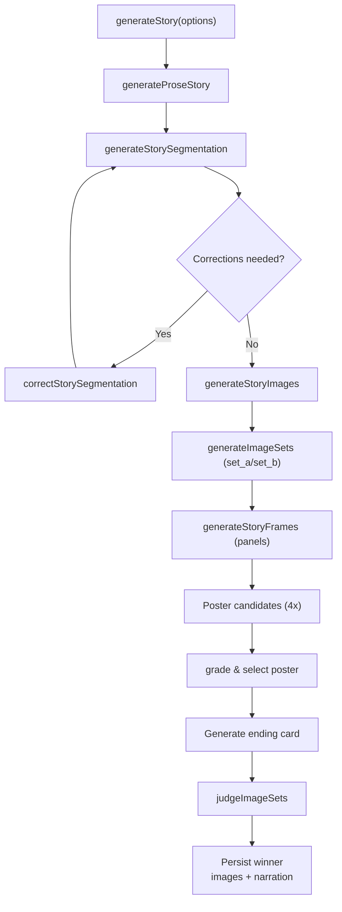
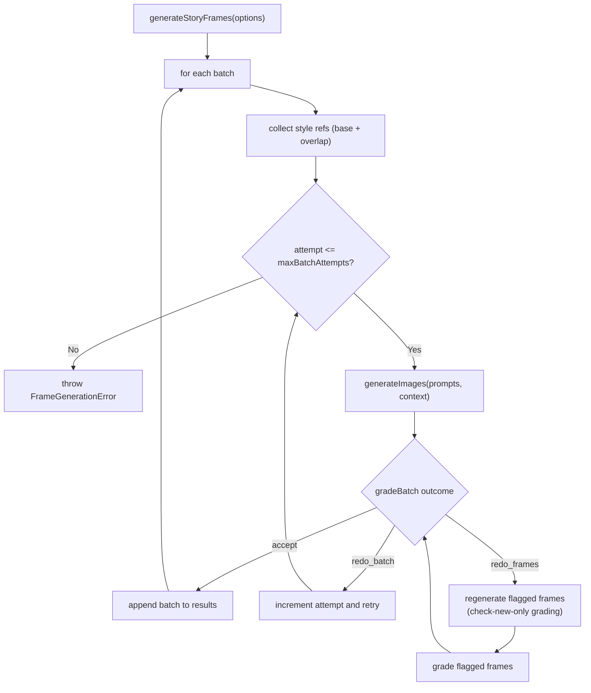

# Story Generation Narrative

This document captures the conceptual flow that powers the historical story pipeline. It is language-agnostic and focuses on the orchestration steps, model prompts, and quality gates rather than runtime commands.

## End-to-End Orchestration



### Prose Ideation

The story text is produced by prompting a web-enabled Gemini 2.5 Pro model. The prompt enforces historical fidelity, single-narrator pacing, and an origin-story anchor:

```text
Write a single-voice, audio-friendly historical story that introduces **${topic}** …
Hard rules: do not relocate the event; do not centre a later adopter; no invented scenes or quotes.
Terminology for learners (mandatory) … Term-glossing is compulsory.
Close: end with a memorable, single-line takeaway … then one factual line on what happened next.
```

### Segmentation Blueprint

Segmentation restructures the prose into narration slices and illustration prompts. It solicits alternating voices, poster/ending cards, and strict scene composition rules:

```text
Requirements:
1. Provide `title`, `posterPrompt`, ten chronological `segments`, and `endingPrompt`.
…
4. For each of the ten `segments`:
   • Provide `narration` … Alternate between the `M` and `F` voices whenever the flow allows.
   • Provide `imagePrompt` … Focus on subject, action, setting, and lighting cues.
5. Keep each `imagePrompt` drawable as a single vintage cartoon panel …
```

### Prompt Correction Loop

The segmentation is checked up to three times by a correction prompt that only rewrites offending images. It lists every panel with narration context and reminds the grader about catastrophic issues (missing protagonist, floating abstractions, etc.). If corrections are returned they are applied immediately; otherwise the segmentation is accepted.

## Frame Generation Workflow

Poster, story panels, and ending card are produced twice (Set A and Set B). Each set shares the same style prompt derived from `ART_STYLE_VINTAGE_CARTOON`.

```text
A beautiful and engaging high quality classic cartoon illustration.
Use a high-positivity tone … Do NOT add borders. Do NOT produce multi-panel images.
Single scene per image.
```

### Batch Grading Loop

`generateStoryFrames` drives the panel production with a batch-oriented retry loop:



Key concepts:

- **Style propagation:** Each batch carries forward a sliding window of prior frames (`overlapSize`) so characters remain consistent; accepted images join the reference pool for partial redos.
- **Catastrophic grading:** The grader schema enforces explicit outcomes (`accept`, `redo_frames`, `redo_batch`) and collects frame indices plus reasons to keep failures explainable.
- **Targeted redos:** When only specific frames fail, they are regenerated individually—each with up to four image attempts—before being re-graded in isolation. Batch retries are capped by `BATCH_GENERATE_MAX_ATTEMPTS`.
- **Deterministic failure:** Exhausting batch retries or frame redo attempts throws immediately, surfacing fatal quality issues to the caller.

### Poster Selection and Ending

After the ten interior frames are locked:

- **Poster candidates:** Each image set spins four concurrent poster renders against the same style prompt and leading frame references. A text-grade pass evaluates all candidates, flags catastrophic artefacts, and selects the most stunning acceptable poster.
- **Ending card:** The last few interior frames seed the style references for a single ending-card render, generated through the same single-image helper that trims prompts and handles retries.

## Dual-Set Comparison

Each run produces two full sets (`set_a`, `set_b`). A Gemini text judge receives every image inline alongside its prompt and returns:

```json
{
  "reasoning": "…",
  "verdict": "set_a"
}
```

Only the winning set is kept for downstream storage.

## Media Packaging

- **Filtering:** Frames 1–10 (indices 1..10) feed the session’s media timeline; poster and ending are excluded from narration assembly.
- **JPEG normalisation:** Images are re-encoded (quality 92, 4:4:4) prior to upload.
- **Narration synthesis:** The alternating `M` / `F` segments are passed to the narration pipeline, keeping the same order as the frames.

The result bundle contains the story text, accepted segmentation, storage paths for the ten canonical frames, and narration metadata. No runtime command knowledge is required to reason about these steps; the process hinges on prompt engineering, iterative grading, and consistent style handoff between model calls.
