# PDF Transcription Benchmark Results

Generated at: 2026-03-02T17:03:07.129Z
Source PDF: /Users/redacted-user/projects/spark/eval/src/benchmarks/pdf-transcription/data/hamilton-2017-q.pdf
JSON report: /Users/redacted-user/projects/spark/data/benchmarks/pdf-transcription/2026-03-02T16-55-09-084Z/benchmark-results.json

Output copies are stored under `output/<config-name>/`.

## Results

| Approach | Strategy | Coord Mode | Status | Pipeline Latency | Pipeline Cost | Total Latency | Total Cost | Judge gemini-2.5-pro | Judge chatgpt-gpt-5.3-codex |
| --- | --- | --- | --- | ---: | ---: | ---: | ---: | --- | --- |
| PDF + gemini-flash-latest | bulk | norm | FAIL | 54.09s | $0.0000 | 145.26s | $0.0210 | PASS | FAIL |
| PDF + gemini-flash-latest | bulk | int1000 | FAIL | 42.27s | $0.0000 | 176.55s | $0.0293 | FAIL | FAIL |
| PDF + gemini-flash-latest | individual | norm | FAIL | 159.05s | $0.0000 | 215.64s | $0.0248 | PASS | FAIL |
| PDF + gemini-flash-latest | individual | int1000 | FAIL | 163.72s | $0.0000 | 190.84s | $0.0266 | FAIL | FAIL |
| PDF + gemini-2.5-pro | bulk | norm | FAIL | 121.95s | $0.0000 | 165.12s | $0.0278 | FAIL | FAIL |
| PDF + gemini-2.5-pro | bulk | int1000 | FAIL | 124.24s | $0.0000 | 179.47s | $0.0268 | FAIL | FAIL |
| PDF + gemini-2.5-pro | individual | norm | FAIL | 444.81s | $0.0000 | 458.21s | $0.0266 | FAIL | FAIL |
| PDF + gemini-2.5-pro | individual | int1000 | FAIL | 416.29s | $0.0000 | 478.03s | $0.0338 | FAIL | FAIL |
| PDF as images + chatgpt-gpt-5.3-codex | bulk | norm | FAIL | 22.37s | $0.0217 | 70.77s | $0.0432 | PASS | FAIL |
| PDF as images + chatgpt-gpt-5.3-codex | bulk | int1000 | PASS | 21.29s | $0.0205 | 101.19s | $0.0423 | PASS | PASS |
| PDF as images + chatgpt-gpt-5.3-codex | individual | norm | FAIL | 49.56s | $0.0466 | 111.56s | $0.0683 | PASS | FAIL |
| PDF as images + chatgpt-gpt-5.3-codex | individual | int1000 | FAIL | 46.07s | $0.0541 | 116.81s | $0.0831 | PASS | FAIL |
| PDF as images + gpt-5.2 | bulk | norm | FAIL | 27.15s | $0.0254 | 93.14s | $0.0642 | FAIL | FAIL |
| PDF as images + gpt-5.2 | bulk | int1000 | FAIL | 25.41s | $0.0299 | 83.98s | $0.0526 | PASS | FAIL |
| PDF as images + gpt-5.2 | individual | norm | FAIL | 59.49s | $0.0750 | 195.78s | $0.1065 | FAIL | FAIL |
| PDF as images + gpt-5.2 | individual | int1000 | FAIL | 58.28s | $0.0689 | 134.03s | $0.0932 | PASS | FAIL |

## Detailed Outputs

### PDF + gemini-flash-latest / bulk / norm
- Status: FAIL
- Reason: [chatgpt-gpt-5.3-codex] The transcribed text for H1–H3 is materially accurate, but the extracted diagrams are not faithful to the source: they are cropped/incomplete and omit important parts of the figures and labels needed to solve the problems.
- Copied output dir: output/pdf-gemini-flash-bulk-norm
- Run dir: /Users/redacted-user/projects/spark/data/benchmarks/pdf-transcription/2026-03-02T16-55-09-084Z/pdf-gemini-flash-bulk-norm
- Output markdown: output/pdf-gemini-flash-bulk-norm/transcription-with-diagrams.md
- Judge gemini-2.5-pro: PASS (91.16s, $0.0099) - The transcription is a faithful representation of the source document for all three problems.
- Judge chatgpt-gpt-5.3-codex: FAIL (10.97s, $0.0111) - The transcribed text for H1–H3 is materially accurate, but the extracted diagrams are not faithful to the source: they are cropped/incomplete and omit important parts of the figures and labels needed to solve the problems.
- Issues: H1 diagram is cropped (left side missing), so the full four-arc square configuration is not fully shown. | H2 diagram is cropped and does not show the full network; key left side (including point A) is missing. | H3 diagram is cropped/incomplete, omitting parts of the square/trapezium layout and labels. | Because these are geometry/network questions, incomplete diagrams are a key fidelity failure even if text is mostly correct.

#### Transcription
```markdown
## H1
The diagram shows four equal arcs placed on the sides of a square. Each arc is a major arc of a circle with radius $1 \text{ cm}$, and each side of the square has length $\sqrt{2} \text{ cm}$.
What is the area of the shaded region?

## H2
A ladybird walks from $A$ to $B$ along the edges of the network shown. She never walks along the same edge twice. However, she may pass through the same point more than once, though she stops the first time she reaches $B$.
How many different routes can she take?

## H3
The diagram shows squares $ABCD$ and $EFGD$.
The length of $BF$ is $10 \text{ cm}$. The area of trapezium $BCGF$ is $35 \text{ cm}^2$.
What is the length of $AB$?

## Extracted Diagrams

### H1


### H2


### H3

```

#### Cropped Diagram Images
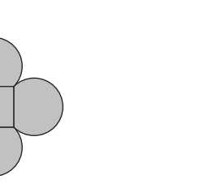
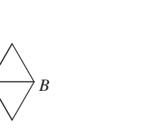
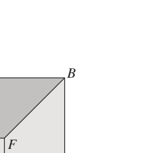

### PDF + gemini-flash-latest / bulk / int1000
- Status: FAIL
- Reason: [gemini-2.5-pro] The transcription fails because two of the three diagrams are severely cropped, rendering the corresponding problems unsolvable. The diagram for H2 is missing the destination point B, and the diagram for H3 is missing points A and B.; [chatgpt-gpt-5.3-codex] The text for H1–H3 is largely accurate, but the extracted diagrams are not materially faithful for H2 and H3 because key parts are cropped/missing.
- Copied output dir: output/pdf-gemini-flash-bulk-int1000
- Run dir: /Users/redacted-user/projects/spark/data/benchmarks/pdf-transcription/2026-03-02T16-55-09-084Z/pdf-gemini-flash-bulk-int1000
- Output markdown: output/pdf-gemini-flash-bulk-int1000/transcription-with-diagrams.md
- Judge gemini-2.5-pro: FAIL (134.27s, $0.0179) - The transcription fails because two of the three diagrams are severely cropped, rendering the corresponding problems unsolvable. The diagram for H2 is missing the destination point B, and the diagram for H3 is missing points A and B.
- Issues: The diagram for question H2 is incomplete. It is cropped and is missing the right side of the network, including the destination point B. | The diagram for question H3 is incomplete. It is cropped and is missing the vertices A and B of the larger square.
- Judge chatgpt-gpt-5.3-codex: FAIL (12.04s, $0.0114) - The text for H1–H3 is largely accurate, but the extracted diagrams are not materially faithful for H2 and H3 because key parts are cropped/missing.
- Issues: H2 diagram is truncated on the right: the full network (including the complete right-hand structure and label B) is not fully visible. | H3 diagram is significantly cropped: important points/edges (including the full outer square and labels such as A and B) are missing. | Because the prompt explicitly includes diagram fidelity, these missing diagram components are material.

#### Transcription
```markdown
## H1
The diagram shows four equal arcs placed on the sides of a square. Each arc is a major arc of a circle with radius 1 cm, and each side of the square has length $\sqrt{2}$ cm.
What is the area of the shaded region?

## H2
A ladybird walks from $A$ to $B$ along the edges of the network shown. She never walks along the same edge twice. However, she may pass through the same point more than once, though she stops the first time she reaches $B$.
How many different routes can she take?

## H3
The diagram shows squares $ABCD$ and $EFGD$. The length of $BF$ is 10 cm. The area of trapezium $BCGF$ is 35 cm$^2$.
What is the length of $AB$?

## Extracted Diagrams

### H1


### H2


### H3

```

#### Cropped Diagram Images
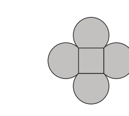
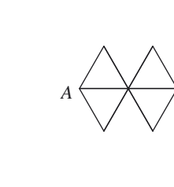
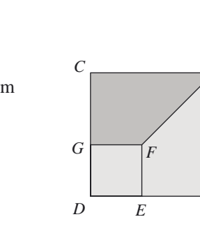

### PDF + gemini-flash-latest / individual / norm
- Status: FAIL
- Reason: [chatgpt-gpt-5.3-codex] The H1–H3 question text is largely accurate, but at least one extracted diagram is materially incomplete compared with the source, so fidelity is insufficient.
- Copied output dir: output/pdf-gemini-flash-individual-norm
- Run dir: /Users/redacted-user/projects/spark/data/benchmarks/pdf-transcription/2026-03-02T16-55-09-084Z/pdf-gemini-flash-individual-norm
- Output markdown: output/pdf-gemini-flash-individual-norm/transcription-with-diagrams.md
- Judge gemini-2.5-pro: PASS (56.58s, $0.0129) - The transcription faithfully reproduces the text, mathematical notation, and diagrams for questions H1, H2, and H3 from the source document.
- Judge chatgpt-gpt-5.3-codex: FAIL (10.56s, $0.0119) - The H1–H3 question text is largely accurate, but at least one extracted diagram is materially incomplete compared with the source, so fidelity is insufficient.
- Issues: H3 diagram extraction is cropped/truncated: the right side of the square and key labelled points (including B and A region) are missing or cut off, and the full diagonal/shape context is not preserved. | Because H3 relies on the geometric configuration and labels, this diagram loss is a key omission, not a minor formatting issue.

#### Transcription
```markdown
## H1
The diagram shows four equal arcs placed on the sides of a square. Each arc is a major arc of a circle with radius $1$ cm, and each side of the square has length $\sqrt{2}$ cm.

What is the area of the shaded region?

## H2
A ladybird walks from A to B along the edges of the network shown. She never walks along the same edge twice. However, she may pass through the same point more than once, though she stops the first time she reaches B.

How many different routes can she take?

## H3
The diagram shows squares $ABCD$ and $EFGD$. The length of $BF$ is $10$ cm. The area of trapezium $BCGF$ is $35\text{ cm}^2$.
What is the length of $AB$?

## Extracted Diagrams

### H1


### H2


### H3

```

#### Cropped Diagram Images
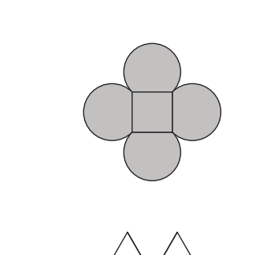
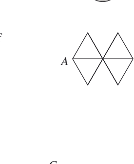
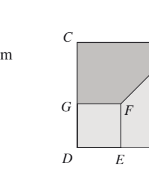

### PDF + gemini-flash-latest / individual / int1000
- Status: FAIL
- Reason: [gemini-2.5-pro] The transcription is not materially faithful because the diagrams for problems H2 and H3 are critically cropped, removing essential information needed to solve the problems. The diagram for H2 is missing the destination point 'B' and half of the network. The diagram for H3 is missing labels for key vertices 'A', 'B', and 'E'.; [chatgpt-gpt-5.3-codex] The text for H1–H3 is largely accurate, but the extracted diagrams are materially incomplete/cropped compared with the source page, which makes the transcription not fully faithful.
- Copied output dir: output/pdf-gemini-flash-individual-int1000
- Run dir: /Users/redacted-user/projects/spark/data/benchmarks/pdf-transcription/2026-03-02T16-55-09-084Z/pdf-gemini-flash-individual-int1000
- Output markdown: output/pdf-gemini-flash-individual-int1000/transcription-with-diagrams.md
- Judge gemini-2.5-pro: FAIL (27.11s, $0.0156) - The transcription is not materially faithful because the diagrams for problems H2 and H3 are critically cropped, removing essential information needed to solve the problems. The diagram for H2 is missing the destination point 'B' and half of the network. The diagram for H3 is missing labels for key vertices 'A', 'B', and 'E'.
- Issues: The diagram for H2 is incomplete. The right side of the network, including the destination point 'B', has been cropped out. | The diagram for H3 is missing the labels for vertices A, B, and E, which are referenced in the problem text.
- Judge chatgpt-gpt-5.3-codex: FAIL (12.27s, $0.0109) - The text for H1–H3 is largely accurate, but the extracted diagrams are materially incomplete/cropped compared with the source page, which makes the transcription not fully faithful.
- Issues: H1 diagram is cropped on the right, cutting off part of the shape (the full four-arc arrangement is not fully visible). | H2 diagram is significantly cropped, showing only part of the network and omitting essential right-side structure/labels needed for the route-counting problem. | H3 diagram is cropped, missing the full square/trapezium configuration on the right (including key geometry context).

#### Transcription
```markdown
## H1
The diagram shows four equal arcs placed on
the sides of a square. Each arc is a major arc of
a circle with radius $1$ cm, and each side of the
square has length $\sqrt{2}$ cm.

What is the area of the shaded region?

## H2
A ladybird walks from A to B along the edges of the network shown. She never walks along the same edge twice. However, she may pass through the same point more than once, though she stops the first time she reaches B.
How many different routes can she take?

## H3
The diagram shows squares $ABCD$ and $EFGD$. The length of $BF$ is $10$ cm. The area of trapezium $BCGF$ is $35~\text{cm}^2$.

What is the length of $AB$?

## Extracted Diagrams

### H1


### H2


### H3

```

#### Cropped Diagram Images
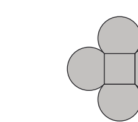
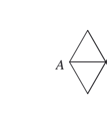
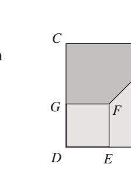

### PDF + gemini-2.5-pro / bulk / norm
- Status: FAIL
- Reason: [gemini-2.5-pro] The text transcription is accurate, but the diagrams provided for questions H2 and H3 are severely cropped and incomplete, rendering the problems unsolvable from the provided transcription. The H2 diagram is missing point B and most of the network. The H3 diagram is missing points A and B.; [chatgpt-gpt-5.3-codex] The transcribed text for H1–H3 is largely accurate, but the included diagrams are materially incomplete/cropped and do not faithfully represent the source figures.
- Copied output dir: output/pdf-gemini-pro-bulk-norm
- Run dir: /Users/redacted-user/projects/spark/data/benchmarks/pdf-transcription/2026-03-02T16-55-09-084Z/pdf-gemini-pro-bulk-norm
- Output markdown: output/pdf-gemini-pro-bulk-norm/transcription-with-diagrams.md
- Judge gemini-2.5-pro: FAIL (43.16s, $0.0163) - The text transcription is accurate, but the diagrams provided for questions H2 and H3 are severely cropped and incomplete, rendering the problems unsolvable from the provided transcription. The H2 diagram is missing point B and most of the network. The H3 diagram is missing points A and B.
- Issues: The diagram for H2 is critically incomplete; point 'B' and a large part of the network are cropped out. | The diagram for H3 is critically incomplete; points 'A' and 'B' are cropped out.
- Judge chatgpt-gpt-5.3-codex: FAIL (10.68s, $0.0115) - The transcribed text for H1–H3 is largely accurate, but the included diagrams are materially incomplete/cropped and do not faithfully represent the source figures.
- Issues: All three extracted diagram images (h1-1, h2-2, h3-3) are heavily cropped, with significant parts of each figure missing. | H2 diagram is missing the right-hand portion of the network (including full structure near B), which is essential to count routes. | H3 diagram is missing the right side/top-right of the square/trapezium figure (including full placement of B/A and segment BF), making the geometric data incomplete. | H1 diagram is also truncated on the right, so the full symmetric four-arc shape is not clearly preserved.

#### Transcription
```markdown
## H1
The diagram shows four equal arcs placed on the sides of a square. Each arc is a major arc of a circle with radius 1 cm, and each side of the square has length $\sqrt{2}$ cm.

What is the area of the shaded region?

## H2
A ladybird walks from $A$ to $B$ along the edges of the network shown. She never walks along the same edge twice. However, she may pass through the same point more than once, though she stops the first time she reaches $B$.

How many different routes can she take?

## H3
The diagram shows squares $ABCD$ and $EFGD$. The length of $BF$ is 10 cm. The area of trapezium $BCGF$ is 35 cm$^2$.

What is the length of $AB$?

## Extracted Diagrams

### H1


### H2


### H3

```

#### Cropped Diagram Images
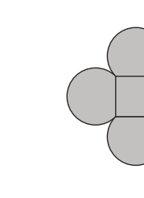
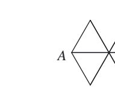
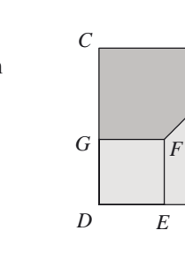

### PDF + gemini-2.5-pro / bulk / int1000
- Status: FAIL
- Reason: [gemini-2.5-pro] The text for all problems has been accurately transcribed. However, the diagrams provided for problems H2 and H3 are severely cropped and incomplete. They are missing key labels and parts of the figures mentioned in the problem descriptions (e.g., point B in H2, points A and B in H3), rendering the problems unsolvable from the information provided.; [chatgpt-gpt-5.3-codex] The text for H1–H3 is largely accurate, but the extracted diagrams are materially incomplete/cropped and therefore not faithful to the source page.
- Copied output dir: output/pdf-gemini-pro-bulk-int1000
- Run dir: /Users/redacted-user/projects/spark/data/benchmarks/pdf-transcription/2026-03-02T16-55-09-084Z/pdf-gemini-pro-bulk-int1000
- Output markdown: output/pdf-gemini-pro-bulk-int1000/transcription-with-diagrams.md
- Judge gemini-2.5-pro: FAIL (55.23s, $0.0159) - The text for all problems has been accurately transcribed. However, the diagrams provided for problems H2 and H3 are severely cropped and incomplete. They are missing key labels and parts of the figures mentioned in the problem descriptions (e.g., point B in H2, points A and B in H3), rendering the problems unsolvable from the information provided.
- Issues: The diagram for problem H2 is incomplete; it is missing point 'B' and the right side of the network. | The diagram for problem H3 is incomplete; it is missing points 'A' and 'B' and significant portions of the square ABCD.
- Judge chatgpt-gpt-5.3-codex: FAIL (9.83s, $0.0109) - The text for H1–H3 is largely accurate, but the extracted diagrams are materially incomplete/cropped and therefore not faithful to the source page.
- Issues: All three referenced diagram images (h1-1.png, h2-2.png, h3-3.png) are severely cropped and do not show the full diagrams from the source. | H1 diagram is missing substantial right-side content (square and arcs not fully visible). | H2 network diagram is incomplete (right side and point B region cut off), which is essential to the route-counting problem. | H3 geometry diagram is incomplete (right side including parts near B/A cut off), so key structure is missing.

#### Transcription
```markdown
## H1
The diagram shows four equal arcs placed on the sides of a square. Each arc is a major arc of a circle with radius 1 cm, and each side of the square has length $\sqrt{2}$ cm.

What is the area of the shaded region?

## H2
A ladybird walks from $A$ to $B$ along the edges of the network shown. She never walks along the same edge twice. However, she may pass through the same point more than once, though she stops the first time she reaches $B$.

How many different routes can she take?

## H3
The diagram shows squares $ABCD$ and $EFGD$. The length of $BF$ is 10 cm. The area of trapezium $BCGF$ is 35 cm$^2$.

What is the length of $AB$?

## Extracted Diagrams

### H1


### H2


### H3

```

#### Cropped Diagram Images
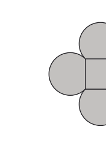
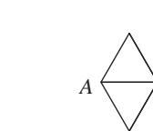
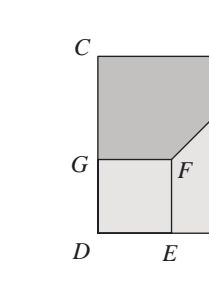

### PDF + gemini-2.5-pro / individual / norm
- Status: FAIL
- Reason: [gemini-2.5-pro] The text transcription is accurate, but the diagrams provided for questions H2 and H3 are incomplete. Key labels for points A and B are missing, rendering the diagrams insufficient to solve the problems.; [chatgpt-gpt-5.3-codex] The text for H1–H3 is largely faithful, but the extracted diagrams are materially incomplete/cropped, so the transcription is not fully faithful to the source.
- Copied output dir: output/pdf-gemini-pro-individual-norm
- Run dir: /Users/redacted-user/projects/spark/data/benchmarks/pdf-transcription/2026-03-02T16-55-09-084Z/pdf-gemini-pro-individual-norm
- Output markdown: output/pdf-gemini-pro-individual-norm/transcription-with-diagrams.md
- Judge gemini-2.5-pro: FAIL (13.39s, $0.0163) - The text transcription is accurate, but the diagrams provided for questions H2 and H3 are incomplete. Key labels for points A and B are missing, rendering the diagrams insufficient to solve the problems.
- Issues: In the diagram for H2, the endpoint 'B' is not visible. | In the diagram for H3, the points 'A' and 'B' are not visible.
- Judge chatgpt-gpt-5.3-codex: FAIL (7.50s, $0.0103) - The text for H1–H3 is largely faithful, but the extracted diagrams are materially incomplete/cropped, so the transcription is not fully faithful to the source.
- Issues: H2 diagram is truncated (right-hand portion of the network is missing), so the graph needed to count routes is not fully represented. | H3 diagram is truncated (right side with key points/edges is cut off), making the geometry incomplete. | H1 extracted diagram appears cropped on the right edge, not cleanly matching the full source figure. | Because diagram content is essential to these questions, missing/cropped diagram elements are a material fidelity failure.

#### Transcription
```markdown
## H1
The diagram shows four equal arcs placed on the sides of a square. Each arc is a major arc of a circle with radius 1 cm, and each side of the square has length $\sqrt{2}$ cm.

What is the area of the shaded region?

## H2
A ladybird walks from A to B along the edges of the network shown. She never walks along the same edge twice. However, she may pass through the same point more than once, though she stops the first time she reaches B.

How many different routes can she take?

## H3
The diagram shows squares $ABCD$ and $EFGD$.
The length of $BF$ is 10 cm. The area of trapezium $BCGF$ is $35 \text{ cm}^2$.
What is the length of $AB$?

## Extracted Diagrams

### H1


### H2


### H3

```

#### Cropped Diagram Images
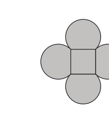
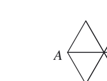
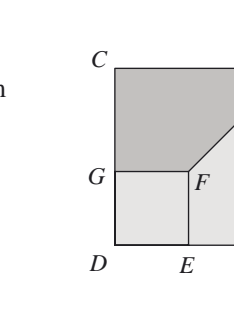

### PDF + gemini-2.5-pro / individual / int1000
- Status: FAIL
- Reason: [gemini-2.5-pro] The text for all problems has been transcribed accurately. However, the diagrams for problems H2 and H3 are severely cropped, omitting essential information required to understand and solve the problems. The diagram for H2 is missing the destination point B and half of the network. The diagram for H3 is missing points A and B, which are part of the main square ABCD.; [chatgpt-gpt-5.3-codex] The text for H1–H3 is transcribed accurately, but the extracted diagrams are not materially faithful for all questions.
- Copied output dir: output/pdf-gemini-pro-individual-int1000
- Run dir: /Users/redacted-user/projects/spark/data/benchmarks/pdf-transcription/2026-03-02T16-55-09-084Z/pdf-gemini-pro-individual-int1000
- Output markdown: output/pdf-gemini-pro-individual-int1000/transcription-with-diagrams.md
- Judge gemini-2.5-pro: FAIL (61.73s, $0.0211) - The text for all problems has been transcribed accurately. However, the diagrams for problems H2 and H3 are severely cropped, omitting essential information required to understand and solve the problems. The diagram for H2 is missing the destination point B and half of the network. The diagram for H3 is missing points A and B, which are part of the main square ABCD.
- Issues: The diagram for H2 is incomplete. It is cropped and is missing the right half of the network, including the destination point 'B'. | The diagram for H3 is incomplete. It is cropped and is missing the top and right portions of the figure, including points 'A' and 'B'.
- Judge chatgpt-gpt-5.3-codex: FAIL (9.35s, $0.0127) - The text for H1–H3 is transcribed accurately, but the extracted diagrams are not materially faithful for all questions.
- Issues: H2 diagram (h2-2.png) is truncated/incomplete: the right half of the network (including full path structure toward B) is missing. | H3 diagram (h3-3.png) is truncated/incomplete: significant right-side geometry and labels are missing (including key parts near A/B and full trapezium/square layout). | Because H2 and H3 rely on complete diagrams, these omissions are material even though the question text is correct.

#### Transcription
```markdown
## H1
The diagram shows four equal arcs placed on the sides of a square. Each arc is a major arc of a circle with radius 1 cm, and each side of the square has length $\sqrt{2}$ cm.
What is the area of the shaded region?

## H2
A ladybird walks from A to B along the edges of the network shown. She never walks along the same edge twice. However, she may pass through the same point more than once, though she stops the first time she reaches B.

How many different routes can she take?

## H3
The diagram shows squares $ABCD$ and $EFGD$. The length of $BF$ is 10 cm. The area of trapezium $BCGF$ is $35 \text{ cm}^2$.
What is the length of $AB$?

## Extracted Diagrams

### H1


### H2


### H3

```

#### Cropped Diagram Images


### PDF as images + chatgpt-gpt-5.3-codex / bulk / norm
- Status: FAIL
- Reason: [chatgpt-gpt-5.3-codex] The transcribed text for H1–H3 is materially accurate, but the extracted diagrams are incorrect and do not match the source question diagrams.
- Copied output dir: output/images-chatgpt-5-3-codex-bulk-norm
- Run dir: /Users/redacted-user/projects/spark/data/benchmarks/pdf-transcription/2026-03-02T16-55-09-084Z/images-chatgpt-5-3-codex-bulk-norm
- Output markdown: output/images-chatgpt-5-3-codex-bulk-norm/transcription-with-diagrams.md
- Judge gemini-2.5-pro: PASS (48.40s, $0.0117) - The transcription is a faithful and accurate representation of the first three problems from the provided PDF. The text, mathematical notation, and diagrams all match the source document.
- Judge chatgpt-gpt-5.3-codex: FAIL (7.63s, $0.0098) - The transcribed text for H1–H3 is materially accurate, but the extracted diagrams are incorrect and do not match the source question diagrams.
- Issues: The image labeled as H1 diagram is not the H1 geometry figure; it is a UKMT logo fragment. | The image labeled as H2 network is not the H2 network graph; it is a fragment of page text/border. | The image labeled as H3 squares/trapezium diagram is not the H3 figure; it is a fragment of instruction text. | Because the diagrams are key to these questions, incorrect diagram extraction is a material fidelity failure.

#### Transcription
```markdown
## H1

The diagram shows four equal arcs placed on the sides of a square. Each arc is a major arc of a circle with radius $1$ cm, and each side of the square has length $\sqrt{2}$ cm.

What is the area of the shaded region?

## H2

A ladybird walks from $A$ to $B$ along the edges of the network shown. She never walks along the same edge twice. However, she may pass through the same point more than once, though she stops the first time she reaches $B$.

How many different routes can she take?

## H3

The diagram shows squares $ABCD$ and $EFGD$. The length of $BF$ is $10$ cm. The area of trapezium $BCGF$ is $35\text{ cm}^2$.

What is the length of $AB$?

## Extracted Diagrams

### H1


### H2


### H3

```

#### Cropped Diagram Images
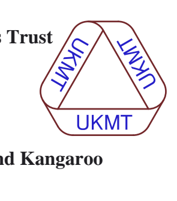
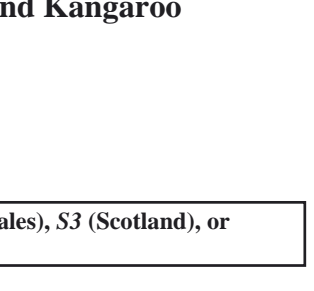
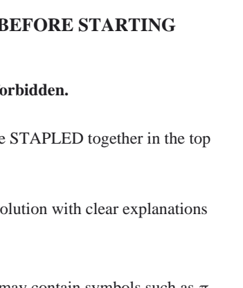

### PDF as images + chatgpt-gpt-5.3-codex / bulk / int1000
- Status: PASS
- Reason: All judges passed
- Copied output dir: output/images-chatgpt-5-3-codex-bulk-int1000
- Run dir: /Users/redacted-user/projects/spark/data/benchmarks/pdf-transcription/2026-03-02T16-55-09-084Z/images-chatgpt-5-3-codex-bulk-int1000
- Output markdown: output/images-chatgpt-5-3-codex-bulk-int1000/transcription-with-diagrams.md
- Judge gemini-2.5-pro: PASS (79.90s, $0.0125) - The transcription is a faithful representation of the first three problems (H1, H2, H3) from the source document. All text, numerical values, and mathematical notations are accurate.
- Judge chatgpt-gpt-5.3-codex: PASS (5.72s, $0.0093) - The transcription is materially faithful to the source for H1–H3, including the key statements, numerical values, and question prompts. The extracted diagrams correspond to the original figures.

#### Transcription
```markdown
## H1

The diagram shows four equal arcs placed on the sides of a square. Each arc is a major arc of a circle with radius $1$ cm, and each side of the square has length $\sqrt{2}$ cm.

What is the area of the shaded region?

## H2

A ladybird walks from $A$ to $B$ along the edges of the network shown. She never walks along the same edge twice. However, she may pass through the same point more than once, though she stops the first time she reaches $B$.

How many different routes can she take?

## H3

The diagram shows squares $ABCD$ and $EFGD$. The length of $BF$ is $10$ cm. The area of trapezium $BCGF$ is $35\text{ cm}^2$.

What is the length of $AB$?

## Extracted Diagrams

### H1


### H2


### H3

```

#### Cropped Diagram Images
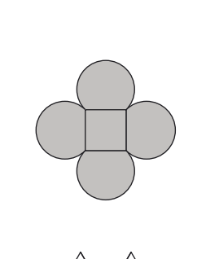
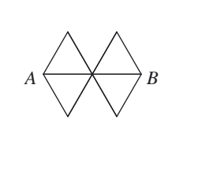
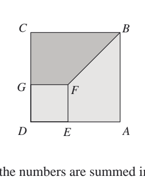

### PDF as images + chatgpt-gpt-5.3-codex / individual / norm
- Status: FAIL
- Reason: [chatgpt-gpt-5.3-codex] The transcription text for H1–H3 is materially accurate, but the extracted diagrams are not faithful: only H1’s diagram is correct, while H2 and H3 diagrams are missing/incorrect (wrong image crops).
- Copied output dir: output/images-chatgpt-5-3-codex-individual-norm
- Run dir: /Users/redacted-user/projects/spark/data/benchmarks/pdf-transcription/2026-03-02T16-55-09-084Z/images-chatgpt-5-3-codex-individual-norm
- Output markdown: output/images-chatgpt-5-3-codex-individual-norm/transcription-with-diagrams.md
- Judge gemini-2.5-pro: PASS (61.98s, $0.0112) - The transcription is a faithful representation of the original document for the specified problems (H1, H2, H3), including all text, mathematical notation, and diagrams.
- Judge chatgpt-gpt-5.3-codex: FAIL (6.56s, $0.0105) - The transcription text for H1–H3 is materially accurate, but the extracted diagrams are not faithful: only H1’s diagram is correct, while H2 and H3 diagrams are missing/incorrect (wrong image crops).
- Issues: H2 diagram image is incorrect: it shows a cropped fragment of page text/header instead of the A-to-B network graph. | H3 diagram image is incorrect: it shows a cropped text fragment instead of the squares/trapezium geometry diagram. | Diagrams are key content for these geometry/combinatorics questions, so missing/incorrect diagram extraction is a material fidelity failure.

#### Transcription
```markdown
## H1

The diagram shows four equal arcs placed on the sides of a square. Each arc is a major arc of a circle with radius $1$ cm, and each side of the square has length $\sqrt{2}$ cm.

What is the area of the shaded region?

## H2

A ladybird walks from $A$ to $B$ along the edges of the network shown. She never walks along the same edge twice. However, she may pass through the same point more than once, though she stops the first time she reaches $B$.

How many different routes can she take?

## H3

The diagram shows squares $ABCD$ and $EFGD$.  
The length of $BF$ is $10$ cm. The area of trapezium $BCGF$ is $35\text{ cm}^2$.

What is the length of $AB$?

## Extracted Diagrams

### H1


### H2


### H3

```

#### Cropped Diagram Images
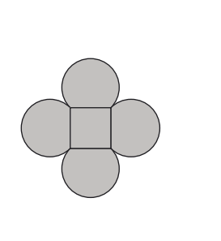
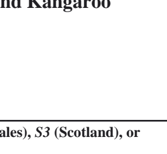
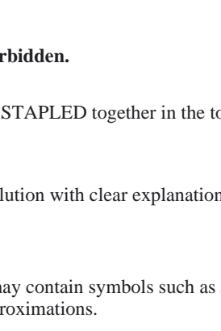

### PDF as images + chatgpt-gpt-5.3-codex / individual / int1000
- Status: FAIL
- Reason: [chatgpt-gpt-5.3-codex] The transcribed text for H1–H3 is accurate, but the source page contains additional problems (H4–H6) and content that are missing, so the transcription is not materially faithful to the full page.
- Copied output dir: output/images-chatgpt-5-3-codex-individual-int1000
- Run dir: /Users/redacted-user/projects/spark/data/benchmarks/pdf-transcription/2026-03-02T16-55-09-084Z/images-chatgpt-5-3-codex-individual-int1000
- Output markdown: output/images-chatgpt-5-3-codex-individual-int1000/transcription-with-diagrams.md
- Judge gemini-2.5-pro: PASS (70.73s, $0.0167) - The transcription of the three problems (H1, H2, H3) is a faithful reproduction of the source document. All text, mathematical notation, and diagrams are correct.
- Judge chatgpt-gpt-5.3-codex: FAIL (10.57s, $0.0123) - The transcribed text for H1–H3 is accurate, but the source page contains additional problems (H4–H6) and content that are missing, so the transcription is not materially faithful to the full page.
- Issues: H4, H5, and H6 from source-page-03.png are omitted entirely. | The transcription appears to cover only part of the page rather than the full source content.

#### Transcription
```markdown
## H1

The diagram shows four equal arcs placed on the sides of a square. Each arc is a major arc of a circle with radius $1$ cm, and each side of the square has length $\sqrt{2}$ cm.

What is the area of the shaded region?

## H2

A ladybird walks from $A$ to $B$ along the edges of the network shown. She never walks along the same edge twice. However, she may pass through the same point more than once, though she stops the first time she reaches $B$.

How many different routes can she take?

## H3

The diagram shows squares $ABCD$ and $EFGD$.
The length of $BF$ is $10$ cm. The area of trapezium $BCGF$ is $35\ \text{cm}^2$.

What is the length of $AB$?

## Extracted Diagrams

### H1


### H2


### H3

```

#### Cropped Diagram Images
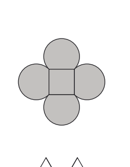
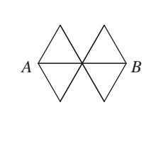
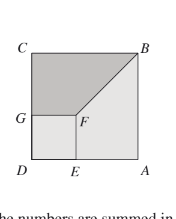

### PDF as images + gpt-5.2 / bulk / norm
- Status: FAIL
- Reason: [gemini-2.5-pro] The transcription of the text for all three problems is accurate. However, the diagrams for problems H2 and H3 are severely cropped and incomplete, making them unusable. The H2 diagram is missing its lower half and the crucial labels 'A' and 'B'. The H3 diagram is cropped, obscuring vertices B and C and the shading that identifies the trapezium BCGF.; [chatgpt-gpt-5.3-codex] The problem text for H1–H3 is largely accurate, but the extracted diagrams are not faithfully transcribed: H2 and H3 images are incomplete/mis-cropped, and H1 includes unrelated content from the next question.
- Copied output dir: output/images-gpt-5-2-bulk-norm
- Run dir: /Users/redacted-user/projects/spark/data/benchmarks/pdf-transcription/2026-03-02T16-55-09-084Z/images-gpt-5-2-bulk-norm
- Output markdown: output/images-gpt-5-2-bulk-norm/transcription-with-diagrams.md
- Judge gemini-2.5-pro: FAIL (65.97s, $0.0271) - The transcription of the text for all three problems is accurate. However, the diagrams for problems H2 and H3 are severely cropped and incomplete, making them unusable. The H2 diagram is missing its lower half and the crucial labels 'A' and 'B'. The H3 diagram is cropped, obscuring vertices B and C and the shading that identifies the trapezium BCGF.
- Issues: The diagram for problem H2 is incomplete. It shows only the top two triangles of the network, while the original diagram has four. The start point 'A' and end point 'B' are also missing. | The diagram for problem H3 is incomplete. It is cropped on the top and right sides, partially or completely cutting off vertices B and C, and obscuring the shading of the trapezium BCGF mentioned in the problem description.
- Judge chatgpt-gpt-5.3-codex: FAIL (8.58s, $0.0117) - The problem text for H1–H3 is largely accurate, but the extracted diagrams are not faithfully transcribed: H2 and H3 images are incomplete/mis-cropped, and H1 includes unrelated content from the next question.
- Issues: Diagram fidelity is poor: h2-2.png does not show the full H2 network (key route structure is missing). | Diagram fidelity is poor: h3-3.png is a partial crop of H3 and includes unrelated surrounding text; the full geometric configuration is not preserved. | h1-1.png includes extra content from below (part of the next diagram), indicating incorrect extraction boundaries.

#### Transcription
```markdown
## H1

The diagram shows four equal arcs placed on the sides of a square. Each arc is a major arc of a circle with radius $1\text{ cm}$, and each side of the square has length $\sqrt{2}\text{ cm}$.

What is the area of the shaded region?

## H2

A ladybird walks from $A$ to $B$ along the edges of the network shown. She never walks along the same edge twice. However, she may pass through the same point more than once, though she stops the first time she reaches $B$.

How many different routes can she take?

## H3

The diagram shows squares $ABCD$ and $EFGD$. The length of $BF$ is $10\text{ cm}$. The area of trapezium $BCGF$ is $35\text{ cm}^2$.

What is the length of $AB$?

## Extracted Diagrams

### H1


### H2


### H3

```

#### Cropped Diagram Images
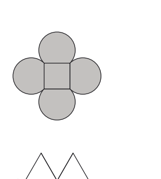
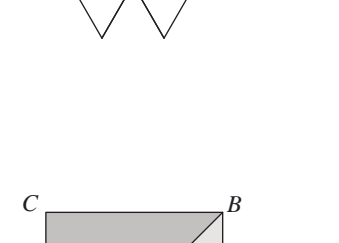
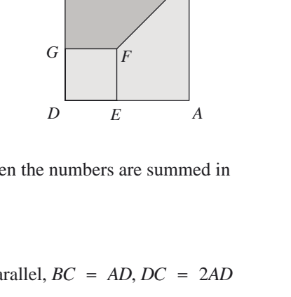

### PDF as images + gpt-5.2 / bulk / int1000
- Status: FAIL
- Reason: [chatgpt-gpt-5.3-codex] The transcribed text for H1–H3 is largely faithful to source page 3, but the extracted diagrams are incorrect: the linked diagram images do not show the H1/H2/H3 question figures from the source and instead appear to be unrelated page crops.
- Copied output dir: output/images-gpt-5-2-bulk-int1000
- Run dir: /Users/redacted-user/projects/spark/data/benchmarks/pdf-transcription/2026-03-02T16-55-09-084Z/images-gpt-5-2-bulk-int1000
- Output markdown: output/images-gpt-5-2-bulk-int1000/transcription-with-diagrams.md
- Judge gemini-2.5-pro: PASS (58.57s, $0.0119) - The transcription accurately reproduces the text and mathematical content of the first three problems (H1, H2, H3) from the source PDF. The diagrams are also correct.
- Judge chatgpt-gpt-5.3-codex: FAIL (7.55s, $0.0109) - The transcribed text for H1–H3 is largely faithful to source page 3, but the extracted diagrams are incorrect: the linked diagram images do not show the H1/H2/H3 question figures from the source and instead appear to be unrelated page crops.
- Issues: All three referenced extracted diagram files (h1-1.png, h2-2.png, h3-3.png) are wrong and do not contain the actual H1/H2/H3 diagrams from source-page-03. | H1 diagram is materially missing/incorrect (shows a UKMT logo crop instead of the square-with-arcs figure). | H2 diagram is materially missing/incorrect (shows instruction-page text crop instead of the network graph from A to B). | H3 diagram is materially missing/incorrect (shows instruction-page text crop instead of the two-squares/trapezium figure).

#### Transcription
```markdown
## H1

The diagram shows four equal arcs placed on the sides of a square. Each arc is a major arc of a circle with radius $1$ cm, and each side of the square has length $\sqrt{2}$ cm.

What is the area of the shaded region?

## H2

A ladybird walks from $A$ to $B$ along the edges of the network shown. She never walks along the same edge twice. However, she may pass through the same point more than once, though she stops the first time she reaches $B$.

How many different routes can she take?

## H3

The diagram shows squares $ABCD$ and $EFGD$. The length of $BF$ is $10$ cm. The area of trapezium $BCGF$ is $35\text{ cm}^2$.

What is the length of $AB$?

## Extracted Diagrams

### H1


### H2


### H3

```

#### Cropped Diagram Images
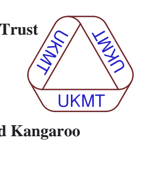
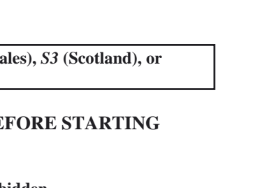
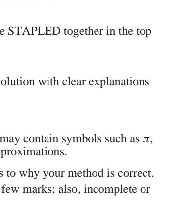

### PDF as images + gpt-5.2 / individual / norm
- Status: FAIL
- Reason: [gemini-2.5-pro] The text for the problems is transcribed correctly. However, the diagrams provided for problems H2 and H3 are poorly cropped and incomplete, making them unusable for solving the problems. The H2 diagram is almost completely missing, and the H3 diagram is cut off, obscuring essential parts of the figure.; [chatgpt-gpt-5.3-codex] The transcribed text for H1–H3 is largely accurate, but the extracted diagrams are not faithful to the source and include incorrect/cropped images, which is a material fidelity issue.
- Copied output dir: output/images-gpt-5-2-individual-norm
- Run dir: /Users/redacted-user/projects/spark/data/benchmarks/pdf-transcription/2026-03-02T16-55-09-084Z/images-gpt-5-2-individual-norm
- Output markdown: output/images-gpt-5-2-individual-norm/transcription-with-diagrams.md
- Judge gemini-2.5-pro: FAIL (136.28s, $0.0205) - The text for the problems is transcribed correctly. However, the diagrams provided for problems H2 and H3 are poorly cropped and incomplete, making them unusable for solving the problems. The H2 diagram is almost completely missing, and the H3 diagram is cut off, obscuring essential parts of the figure.
- Issues: The diagram for H2 is incorrect. It's a badly cropped image that doesn't show the network graph mentioned in the problem. | The diagram for H3 is incomplete. It's cropped, so key points like A, B, and C are not visible.
- Judge chatgpt-gpt-5.3-codex: FAIL (7.87s, $0.0110) - The transcribed text for H1–H3 is largely accurate, but the extracted diagrams are not faithful to the source and include incorrect/cropped images, which is a material fidelity issue.
- Issues: H1 diagram is incorrect: the image shown is a UKMT logo, not the shaded-arc square diagram from question H1. | H2 diagram is incorrect/incomplete: the network graph is heavily cropped and does not clearly show the full A-to-B structure needed for the question. | H3 diagram is incomplete/cropped: only part of the squares/trapezium figure is shown, omitting key labels and geometry from the original diagram. | Because these questions are diagram-dependent, incorrect/missing diagram content makes the transcription materially unfaithful.

#### Transcription
```markdown
## H1

The diagram shows four equal arcs placed on the sides of a square. Each arc is a major arc of a circle with radius $1\text{ cm}$, and each side of the square has length $\sqrt{2}\text{ cm}$.

What is the area of the shaded region?

## H2

A ladybird walks from $A$ to $B$ along the edges of the network shown. She never walks along the same edge twice. However, she may pass through the same point more than once, though she stops the first time she reaches $B$.

How many different routes can she take?

## H3

The diagram shows squares $ABCD$ and $EFGD$. The length of $BF$ is $10\text{ cm}$. The area of trapezium $BCGF$ is $35\text{ cm}^2$.

What is the length of $AB$?

## Extracted Diagrams

### H1


### H2


### H3

```

#### Cropped Diagram Images
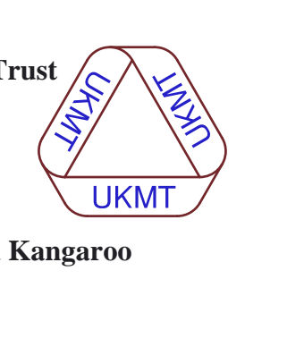
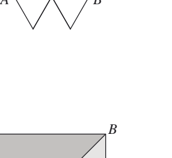
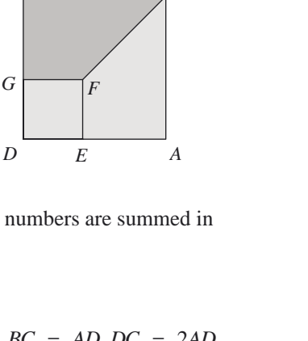

### PDF as images + gpt-5.2 / individual / int1000
- Status: FAIL
- Reason: [chatgpt-gpt-5.3-codex] The H1–H3 question text is largely accurate, but the extracted diagrams are not faithful to the source and appear to be unrelated cropped regions. Since these problems depend on correct figures, this is a material fidelity failure.
- Copied output dir: output/images-gpt-5-2-individual-int1000
- Run dir: /Users/redacted-user/projects/spark/data/benchmarks/pdf-transcription/2026-03-02T16-55-09-084Z/images-gpt-5-2-individual-int1000
- Output markdown: output/images-gpt-5-2-individual-int1000/transcription-with-diagrams.md
- Judge gemini-2.5-pro: PASS (75.74s, $0.0144) - The transcription is a perfect match for the first three problems (H1, H2, H3) from the source PDF. All text, mathematical values, and diagrams are correct.
- Judge chatgpt-gpt-5.3-codex: FAIL (7.18s, $0.0099) - The H1–H3 question text is largely accurate, but the extracted diagrams are not faithful to the source and appear to be unrelated cropped regions. Since these problems depend on correct figures, this is a material fidelity failure.
- Issues: All three extracted diagram images (H1, H2, H3) are incorrect/mismatched and do not show the actual problem figures from the source page. | H1 diagram is missing (shown image is a UKMT logo fragment instead of the square-with-arcs figure). | H2 diagram is missing (shown image is a text box fragment instead of the network from A to B). | H3 diagram is missing (shown image is body-text fragment instead of the squares/trapezium geometry figure).

#### Transcription
```markdown
## H1

The diagram shows four equal arcs placed on the sides of a square. Each arc is a major arc of a circle with radius $1$ cm, and each side of the square has length $\sqrt{2}$ cm.

What is the area of the shaded region?

## H2

A ladybird walks from $A$ to $B$ along the edges of the network shown. She never walks along the same edge twice. However, she may pass through the same point more than once, though she stops the first time she reaches $B$.

How many different routes can she take?

## H3

The diagram shows squares $ABCD$ and $EFGD$.
The length of $BF$ is $10\text{ cm}$. The area of trapezium $BCGF$ is $35\text{ cm}^2$.

What is the length of $AB$?

## Extracted Diagrams

### H1


### H2


### H3

```

#### Cropped Diagram Images
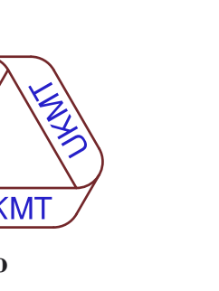
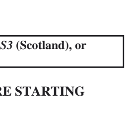
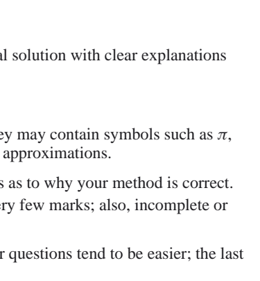
