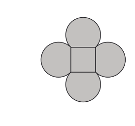
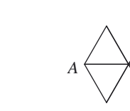
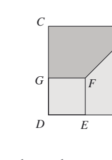

## H1
The diagram shows four equal arcs placed on the sides of a square. Each arc is a major arc of a circle with radius 1 cm, and each side of the square has length $\sqrt{2}$ cm.
What is the area of the shaded region?

## H2
A ladybird walks from A to B along the edges of the network shown. She never walks along the same edge twice. However, she may pass through the same point more than once, though she stops the first time she reaches B.

How many different routes can she take?

## H3
The diagram shows squares $ABCD$ and $EFGD$. The length of $BF$ is 10 cm. The area of trapezium $BCGF$ is $35 \text{ cm}^2$.
What is the length of $AB$?

## Extracted Diagrams

### H1

### H2

### H3

